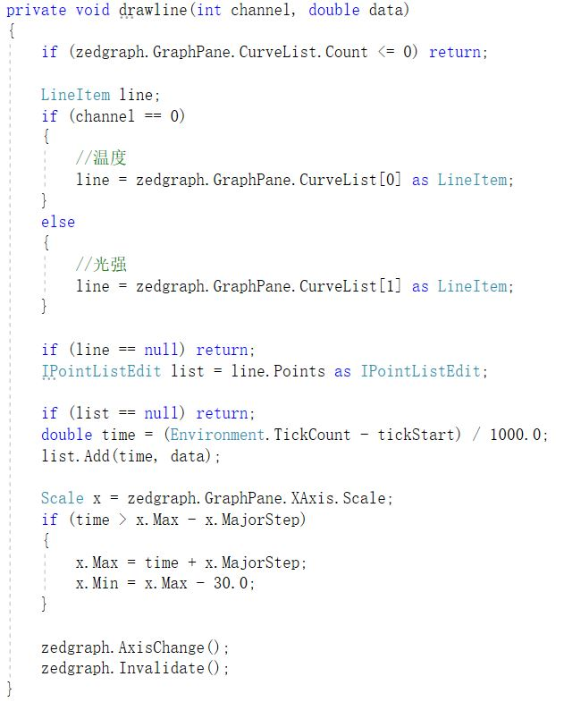

# 实验四 C# .NET 综合应用程序开发

## 功能概述：

1. PC与Arduino的交互；
2. 通过MIDI协议接收实时光强与温度的AD转换值，并转为曲线图；
3. 接收MIDI格式的回传数据；
4. 通过滑块控制Arduino五个LED的亮灭和明暗；
5. 通过发送MIDI信息控制LED的亮灭和明暗；
6. 实现五种颜色的RGB动态混合；
7. 记录MIDI数据的结果。

## 项目特色：

1. 滑块控制LED明暗；
2. 混色动态显示；
3. 温度光强信息的曲线图转换；
4. 日志文件实时记录。

## 代码总量：

约700行

## 工作时间：

约五天

## 结论：

如图所示

a)     在1处：combobox显示所有pc机上的串口名，1处combobox显示设定的传输波特率速率(BPS)（9600、19200、38400、57600）。选择该速率时，与Arduino开发板的串口BaudRate一致。

显示串口名：

选择速率，默认为38400：

b)      在2处：点击“连接”按钮连接到开发板，2处点击“关闭”按钮断开连接。

连接：

断开：

c)      在3处：显示发送的数据和返回的实时信息。

绑定数据：

接收数据并将数据返回到对应文本框中：

d)      在4处，显示出Arduino上温度、光强随时间变化的曲线图。在位置7显示出两个数据物理数值，光强度可以用ADC值表示。

对ZedGraph进行设置如下：

在DataReceivedHandler中判断收到的返回数据第一位是否为E，若是，则调用drawline函数进行曲线绘制。

e)      在6处：利用滑块(slider)控制Arduino板上的PWM输出端，实现五种LED灯的明暗控制（数值范围0-255），在界面的○处显示RGB混合色,发送按钮将设定的各LED的PWM值以MIDI协议规定的格式发送给Arduino，Arduino可以完成各PWM输出端的PWM数值设定。

动态RGB混合色的实现：当滑块值改变时触发事件

实现拖动滑块变化对应LED灯亮度的功能：

最初设想在同一事件中实现，但会抛出偏置值越界的异常，所以考虑在MouseLeftButtonUp事件中实现这个功能。但由于Slider由RepeatButton和Thumb组成，拖动滑块时会先触发RepeatButton的MouseLeftButtonUp，之后将e.Handled设为真，所以无法进入滑块的MouseLeftButtonUp事件，故使用AddHandler方法，不论第三个参数是否为true都要执行该方法。

f)       在7处：点击log开始按钮，显示FileDialog让用户填写需要记录的文件名，文件名的缺省值：log-YYYY-MM-DD-HH-mm-SS.txt,YYYY为年份、MM为月份、DD为日期、HH为时、mm为分、SS为秒，用户点击OK就开始记录实时信息，点击Cancel放弃本次记录。点击log结束按钮，将记录结果存盘关闭。需要存储的数据为：温度和LED灯PWM数据、串口设定值、实时通讯数据等，存储格式为csv或Json或XML等格式之一。

程序运行过程中截图如下：

 

